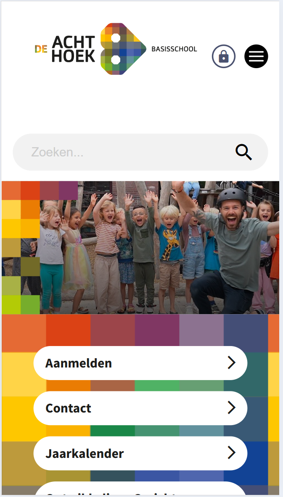
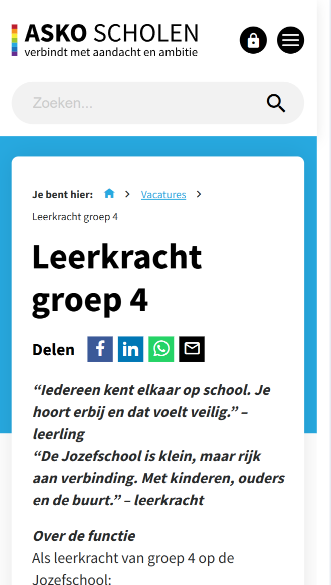

# Procesverslag
Markdown is een simpele manier om HTML te schrijven.  
Markdown cheat cheet: [Hulp bij het schrijven van Markdown](https://github.com/adam-p/markdown-here/wiki/Markdown-Cheatsheet).

Nb. De standaardstructuur en de spartaanse opmaak van de README.md zijn helemaal prima. Het gaat om de inhoud van je procesverslag. Besteedt de tijd voor pracht en praal aan je website.

Nb. Door *open* toe te voegen aan een *details* element kun je deze standaard open zetten. Fijn om dat steeds voor de relevante stuk(ken) te doen.


## Jij

<details open>
  <summary>uitwerken voor kick-off werkgroep</summary>

hier je focus (kies uit responsive óf surface plane)
### Auteur: Ruba

#### Je startniveau:
blauw (beginner) – ik heb nog weinig ervaring met HTML, CSS en JavaScript en wil vooral de basis goed leren.

#### Je focus:
responsive – ik wil oefenen om mijn website mobile-first te bouwen en daarna uitbreiden naar een desktop-versie.  

</details>


## Je website

<details open>
  <summary>uitwerken voor kick-off werkgroep</summary>

  ### Je opdracht:
  Ik maak een bestaande schoolwebsite na. Ik kies de homepage en één tweede pagina.  
  De originele website is van Basisschool De Achthoek: [https://www.achthoek.nl](https://www.achthoek.nl)

  #### Screenshot(s) van de eerste pagina (small screen): 
  hier de naam van de pagina  
  

  #### Screenshot(s) van de tweede pagina (small screen):
  hier de naam van de pagina  
  
  
</details>


## Toegankelijkheidstest 1/2 (week 1)

<details>
  <summary>uitwerken na test in 2<sup>e</sup> werkgroep</summary>

  ### Bevindingen
  Lijst met je bevindingen die in de test naar voren kwamen:
  ## Toegankelijkheidstest 1/2 (week 1)

### Screenreader-test (NVDA)

**Ervaring:**
Tijdens het testen met NVDA merkte ik dat de Achthoek-website moeilijk te begrijpen is voor een screenreader.  
- De screenreader leest alle teksten achter elkaar als platte tekst, zonder duidelijke structuur.  
- Een keuzemenu werd niet aangekondigd als “menu” maar gewoon als losse tekst.  
- Foto’s, zoals die bij de activiteitenkaarten, hadden geen alt-tekst en werden daardoor volledig genegeerd.  
- Het icoon van “commentaar” bij een activiteit werd niet benoemd.  
- De activiteitenkaarten (met titel, korte tekst, foto en icoon) waren visueel duidelijk, maar de screenreader zag dit niet als één geheel; hij las het gewoon als losse stukjes tekst.

**Conclusie:**  
De site is visueel duidelijk, maar voor screenreader-gebruikers erg lastig te begrijpen. Dit laat zien hoe belangrijk semantische HTML, alt-teksten en duidelijke labels zijn.  

**Voorbeelden hoe ik dit in mijn eigen site wil oplossen:**    
- Bij **foto’s** wil ik altijd een korte beschrijving toevoegen, zodat duidelijk wordt wat er op de foto te zien is.  
- Bij **iconen**, zoals een reactie-icoon, wil ik zorgen dat de functie wordt uitgesproken (bijvoorbeeld “geef een reactie”) of aangeven dat het puur decoratief is.  
- **Kaarten** (zoals activiteitenblokken) wil ik duidelijk structureren met een titel, tekst en eventuele knoppen die samen één geheel vormen, zodat de screenreader dit ook als groep kan voorlezen.  
- Bij **menu’s en lijsten** wil ik echte HTML-elementen gebruiken, zodat NVDA ze ook als menu of lijst aankondigt in plaats van losse tekst.  

- **Alt-teksten toevoegen aan afbeeldingen:**  
  ```html
  

### Bevindingen
- Ik kon niet direct naar de hoofdinhoud springen; er is geen skip-link.  
- Bij afbeeldingen hoorde ik geen beschrijvende alt-teksten.   
- Het contrast tussen tekst en achtergrond wil ik nog extra testen.
- Contrast niet gecheckt Teksten op gekleurde achtergronden kunnen er visueel oké uitzien maar onvoldoende contrast hebben  


</details>


## Breakdownschets (week 1) (hij staat in Miro )


<details>
  <summary>uitwerken na afloop 3<sup>e</sup> werkgroep</summary>

  ### de hele pagina: 
  

  ### dynamisch deel (bijv menu): 
  

  ### wellicht nog een dynamisch deel (bijv filter): 
  

</details>


## Voortgang 1 (week 2)

<details>
  <summary>uitwerken voor 1<sup>e</sup> voortgang</summary>

### Stand van zaken
- Mijn code is tot nu toe netjes en semantisch, dit werd ook bevestigd tijdens de meeting.  
- Ik had een vraag of ik meerdere `<nav>`-elementen mag gebruiken → dit mag, bijvoorbeeld één in de header en één in de main.  
- Tip gekregen dat achtergrondfoto’s beter in CSS gezet kunnen worden en niet in HTML, omdat een screenreader ze niet hoeft te lezen.  
- Ik gebruikte `<section>` voor de activiteitenkaarten, maar kreeg de feedback dat `<ul>` en `<li>` logischer zijn omdat de kaarten echt een lijst vormen.

### Agenda voor meeting
| Ruba          | Student 2           | Student 3    | Student 4        |
|---------------|---------------------|--------------|------------------|
| Check of mijn code semantisch correct is | Eigen punt invullen | Eigen punt invullen | Eigen punt invullen |
| Vraag over meerdere `<nav>` gebruiken   | …                   | …                | …                  |
| Feedback op gebruik van `<section>`     | …                   | …                | …                  |

### Verslag van meeting
- Code is semantisch correct tot nu toe.  
- Het is prima om twee navigatie-elementen te gebruiken.  
- Achtergrondfoto’s beter via CSS doen i.p.v. HTML.  
- Voor de activiteitenkaarten liever `<ul>` en `<li>` gebruiken i.p.v. `<section>`.  

</details>


## Voortgang 2 (week 3)

<details>
  <summary>uitwerken voor 2<sup>e</sup> voortgang</summary>

  ### Vragen die ik wil stellen tijdens mijn voortgangsgesprek 2

1. De website die ik heb gekozen heeft een lastige vormgeving. Wat is tijdens de beoordeling belangrijker:  
   - dat ik de vormgeving precies namaak zoals de echte website,  
   - of dat ik vooral laat zien welk proces ik heb doorlopen en welke technieken ik heb geleerd?  

2. De originele website bevat veel details, zoals hover-effecten en speciale fotospellen. Moet ik dat allemaal precies nadoen, ook al heb ik gekozen voor de focus **responsive**?  

3. Mag ik de stijl aanpassen als ik denk dat het beter is voor de **toegankelijkheid**?  

4. Wat is beter: de afbeeldingen uit de originele website downloaden en zelf gebruiken, of ze direct via een link insluiten?  

5. Ik heb alleen het document *Beoordelingsformulier Blok Web 2025/26 – Frontend Development* gezien. Bestaat er ergens een uitgebreider overzicht met alle beoordelingscriteria?  

  
  
  
  ### Stand van zaken
  hier dit ging goed & dit was lastig (neem ook screenshots op van delen van je website en code)


  ### Agenda voor meeting
  samen met je groepje opstellen

  | student 1      | student 2          | student 3    | student 4        |
  | ---            | ---                | ---          | ---              |
  | dit bespreken  | en dit             | en ik dit    | en dan ik dat    |
  | en dat ook nog | dit als er tijd is | nog een punt | dit wil ik zeker |
  | ...            | ...                | ...          | ...              |


  ### Verslag van meeting
  hier na afloop snel de uitkomsten van de meeting vastleggen

  - punt 1
  - punt 2
  - nog een punt
- ...

</details>


## Toegankelijkheidstest 2/2 (week 4)

<details>
  <summary>uitwerken na test in 9<sup>e</sup> werkgroep</summary>

  ### Bevindingen
  Lijst met je bevindingen die in de test naar voren kwamen (geef ook aan wat er verbeterd is):

</details>


## Voortgang 3 (week 4)

<details>
  <summary>uitwerken voor 3<sup>e</sup> voortgang</summary>

  ### Stand van zaken
  hier dit ging goed & dit was lastig (neem ook screenshots op van delen van je website en code)


  ### Agenda voor meeting
  samen met je groepje opstellen

  | student 1      | student 2          | student 3    | student 4        |
  | ---            | ---                | ---          | ---              |
  | dit bespreken  | en dit             | en ik dit    | en dan ik dat    |
  | en dat ook nog | dit als er tijd is | nog een punt | dit wil ik zeker |
  | ...            | ...                | ...          | ...              |


  ### Verslag van meeting
  hier na afloop snel de uitkomsten van de meeting vastleggen

  - punt 1
  - punt 2
  - nog een punt
  - ...

</details>


## Eindgesprek (week 5)

<details>
  <summary>uitwerken voor eindgesprek</summary>

  ### Je uitkomst - karakteristiek screenshots:
  


  ### Dit ging goed/Heb ik geleerd: 
  Korte omschrijving met plaatjes

  


  ### Dit was lastig/Is niet gelukt:
  Korte omschrijving met plaatjes

  
</details>


## Bronnenlijst

<details open>
  <summary>continu bijhouden terwijl je werkt</summary>

  Nb. Wees specifiek ('css-tricks' als bron is bijv. niet specifiek genoeg). 
  Nb. ChatGpT en andere AI horen er ook bij.
  Nb. Vermeld de bronnen ook in je code.

  1. bron 1
  2. bron 2
  3. ...

</details>